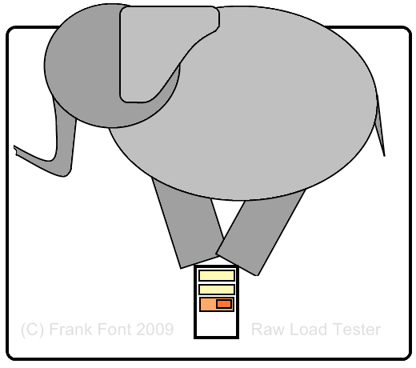

# Raw Load Tester

This open source configurable javascript/PHP application calls the URL you select as many times as you choose and tells you how long it took the server to respond. It writes some additional runtime details to the PHP log file so you can optionally do more granular analysis afterwards.

## Usage

Place the contents of this repo to the docroot folder of a PHP enabled webserver such as Apache.  You can then open the RawLoadTester.php page in your browser and try it out.  The instructions are on the page.

## Metrics

Although the server processes most of the statistics, all URL requests come from the browser. You can run as many browsers and workstations simultaneously as you want. 
